  <picture>
    <source media="(prefers-color-scheme: dark)" srcset="assets/headerDark.svg" />
    
  </picture>

_**C**reate **O**nce **S**ync **E**verywhere_

配合 [doocs/md](https://github.com/doocs/md) Markdown 编辑器使用的浏览器扩展，支持一键将文章同步到多个内容平台。

> 本插件完全本地运行，不收集、不存储任何用户信息。**如需添加更多平台或改善同步准确度，欢迎提 [Issue](https://github.com/doocs/cose/issues) 或 [PR](https://github.com/doocs/cose/pulls)**。

## 使用方法

> 点击观看视频：  

1. 先点击安装扩展  然后打开 [md.doocs.org](https://md.doocs.org) 或本地开发环境
2. 编辑 Markdown 内容
3. 点击顶部的 **发布** 按钮
4. 在弹出的对话框中选择要同步的平台
5. 点击 **确定** 开始同步

## 特性

- 编辑一次，同步到多个平台
- 自动检测各平台登录状态
- 同步的标签页自动归入分组，便于管理
- 微信公众号同步时完整保留渲染样式并自动保存为草稿

## 已支持的平台

> 更多想要添加的平台欢迎提 [Issue](https://github.com/doocs/cose/issues) ！
>
> 

> 
已支持平台速查表(点击展开)

>
> | 字母 | 平台 |
> |:---:|:---|
> | A | 阿里云社区 |
> | B | B站专栏、百度云千帆、百家号、博客园 |
> | C | CSDN |
> | D | 抖音文章 |
> | H | 华为开发者文章、华为云博客、火山引擎社区 |
> | I | InfoQ |
> | J | 简书、掘金、今日头条 |
> | K | 开源中国 |
> | M | Medium、ModelScope 魔搭社区 |
> | S | 少数派、搜狐号、思否 |
> | T | 腾讯云 |
> | W | 网易号、微博文章、微信公众号 |
> | X | X(Formerly Twitter) Articles |
> | Z | 支付宝开放平台、知乎 |
> | 5 | 51CTO |
>
> 

### 媒体平台

### 博客平台

  

### 云平台及其开发者社区
 

  
  
  
  
  
  
  
  
  
  
   
  <!--  -->
  
  
  
  

## 开发者模式测试

1. 克隆或下载本项目
2. 打开 Chrome 浏览器，进入 `chrome://extensions/`
3. 开启右上角的 **开发者模式**
4. 点击 **加载已解压的扩展程序**
5. 选择 `cose` 目录
